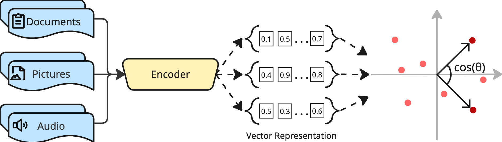

# Advanced AI-Driven Search

## Overview
This is a companion notebook to the article *Advanced AI-Driven Search* that dives into more sophisticated approaches for RAG and other AI applications. Modern search encodes documents (text, images, audio) into vector representations and retrieves them by similarity (e.g. cosine distance), as recapped below.

  

Building on this foundation, the notebook demonstrates and visualizes several techniques for improving a basic RAG pipeline, each with reusable code:

- **Sparse & learned sparse retrieval** (BM25, SPLADE) and hybrid search with Reciprocal Rank Fusion
- **Metadata-aware search** via score boosting and a mixture-of-encoders unified embedding
- **Multi-vector late interaction** re-ranking (ColBERT) accelerated with MUVERA
- **Wormhole vectors** for traversing between dense and sparse vector spaces

All the code is provided in the notebok `notebooks/advanced_ai_driven_search.ipynb`.